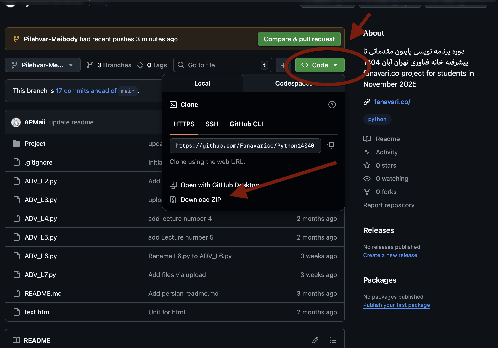
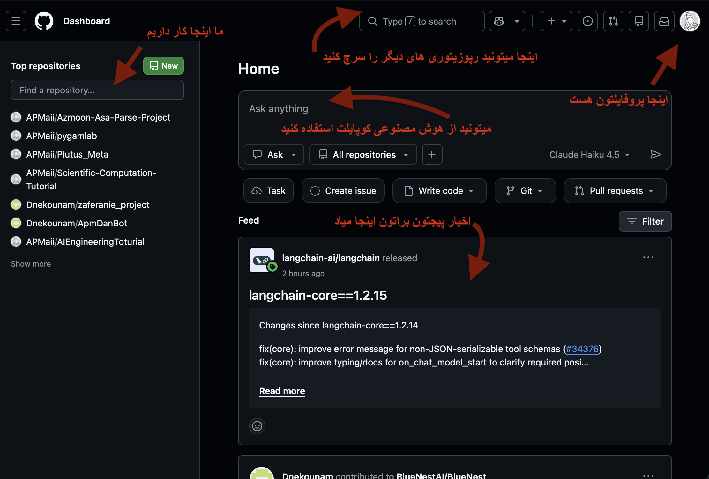
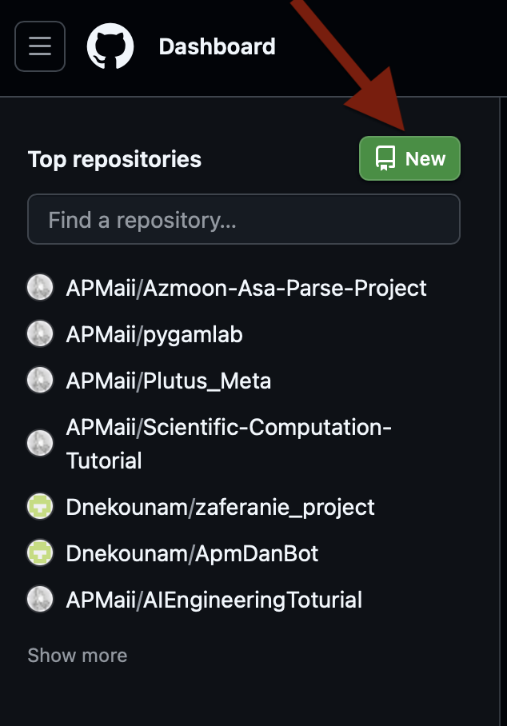
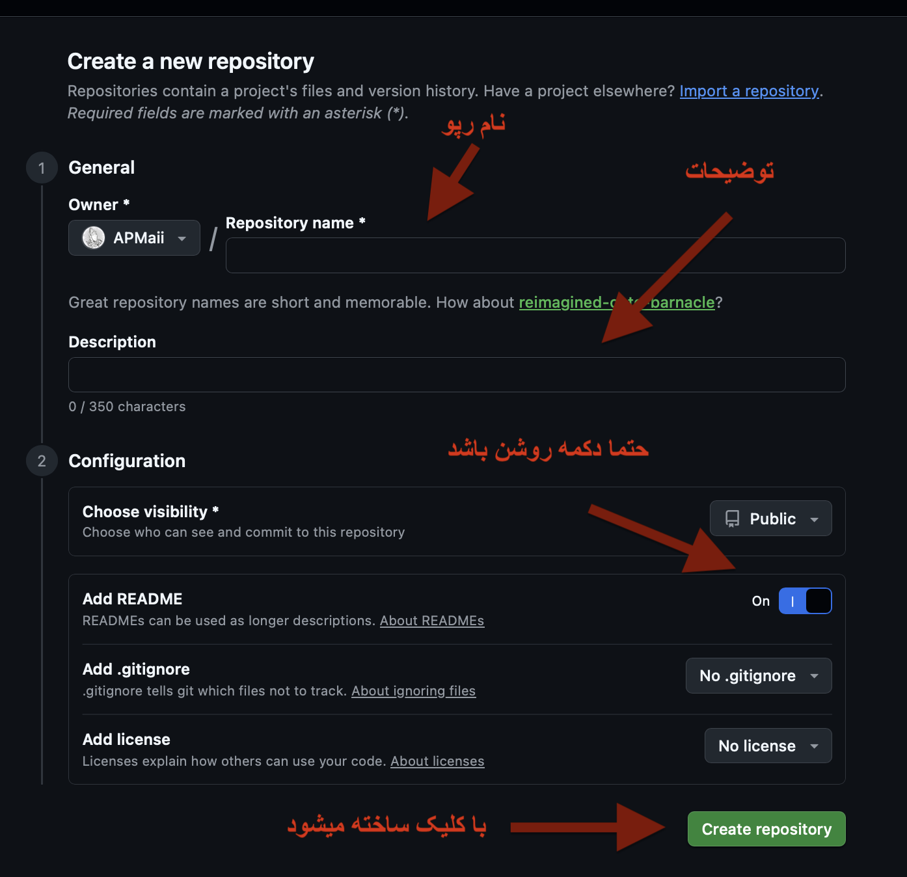

# Github Tutorial

inja ghasd darim dars bedim ke chijori vaghty shoma khastid shoro konid porozhe ro bayad kole porozhe ro az github download konid va tooye github yek **repo** besazid bva onja bargozari konid porozhatoon ro

## Download all files
aval b addresse [File project](https://github.com/Fanavarico/Python140408/tree/Pilehvar-Meibody) beravid -click konid rooye link-

- [LINK](https://github.com/Fanavarico/Python140408/tree/Pilehvar-Meibody)

badesh kafie kheyli sade rooye download bezanid mesle axe zir va kole file ha download mishe ama shoma fght b file e **Project** niaz darid

hala shoma kafie berid va b tamame file ha dastresi darid yani
- database.py
- models.py
- crud.py
- seed.py
- main.py

## Sakhte accoun dar Github
varede site **github** beshavid

linke sabte nam --> [Link](https://github.com/)
rooye sign up bezanid va sign upeton ro anjam bedid kheyli sade

## Home page github
bad az inke **login** mikonid shoma hamchin safe ee darid hamishe

dar asl hamchin chizi mibinid k tozihate kamel too ax hast

## Sakhtane Repository
dar asl repository yek chizi hast k shoma misazid va in be shoma ejaze mdie koli file mesle .py harchi k deletoon bekhayd ro bargozari konid va hamchenin edit konid

baraye skahtesh b safeye asliton berid [Link safe asli](https://github.com/)
rooye **gozine sabz** repo click konid

hala bayd inja esm bezarid baraye repository
esme repoye shoam bayd ye hamchin chizi bashad
quiz_management_Ali_Pilehvar

bejaye **ali_pilehvar** esme khodetoon ro benevisid

dar ghesmate description ham toizhat benevisid

hatman gozineye **Add README** ro On bezanid

va dar akahr rooye dokmeye **create repository** click konid
hala shoma yek repository darid

